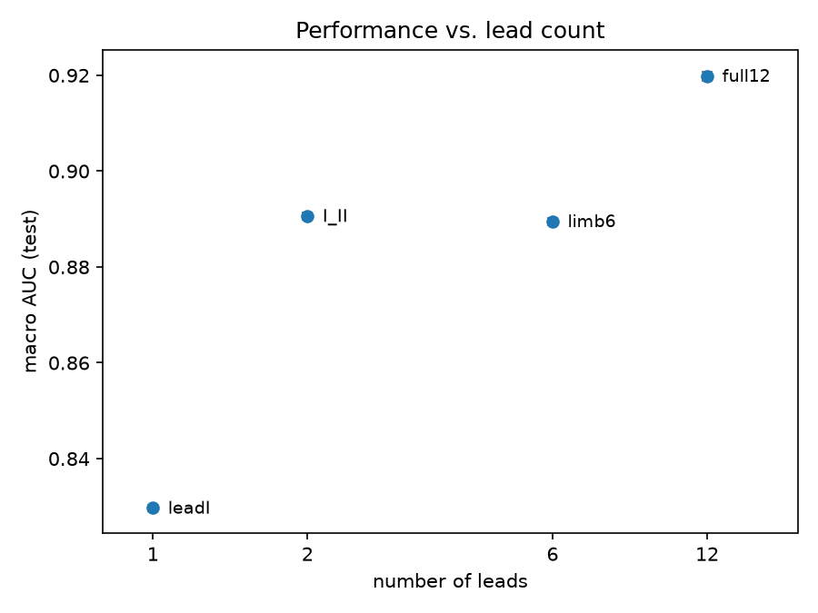
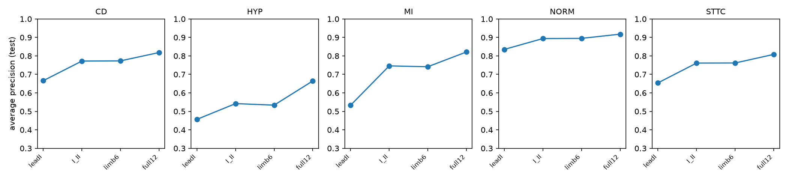
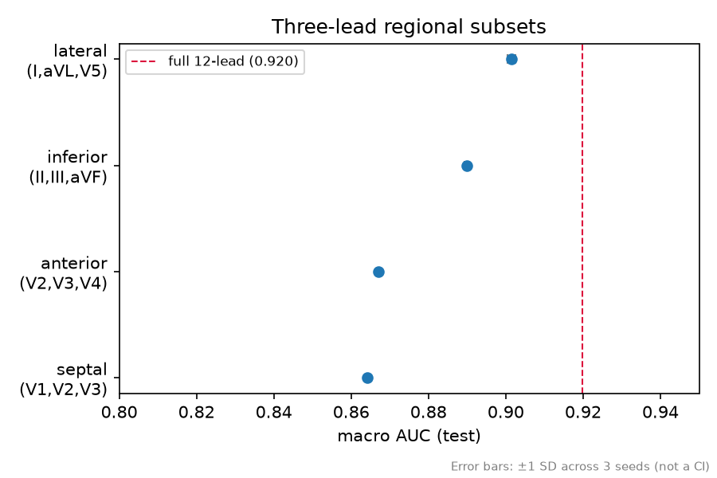

# Lead-Reduction Ablation on PTB-XL

**How much diagnostic information survives when an ECG is recorded with fewer leads?**

Consumer ECG devices record one lead (AliveCor KardiaMobile, ~$79) or six (KardiaMobile 6L, ~$129),
while clinical machines record twelve. This project trains a 1D CNN on PTB-XL diagnostic
superclasses and systematically removes leads to determine which lead combinations yield the best 
outcomes.

Two findings:

- **The second lead matters more than the other ten combined.** Going from lead I alone to
  leads I + II gains 0.061 macro AUC; going from I + II to the full twelve gains 0.029.
- **Four of the six limb leads are free.** Leads III, aVR, aVL and aVF are linear combinations
  of I and II, so a six-lead limb recording contains no more information than a two-lead one.
  The model scores all rank-2 limb configurations near identically (within 0.001 of each other)
  confirming that the network is sensitive to information content and indifferent to how that
  information is presented.

All numbers below are from PTB-XL fold 10, held out and evaluated once after all
hyper-parameters were frozen (n_epochs=10, max_lr=3e-3, weight_decay=0.0).

---

## Results

### Performance vs. lead count



| Lead set | Leads | Macro AUC (test) |
|---|---|---|
| `full12` | 12 | 0.9198 |
| `lateral` (I, aVL, V5) | 3 | 0.9014 |
| `chest6` (V1–V6) | 6 | 0.8952 |
| `I_II` | 2 | 0.8906 |
| `inferior` (II, III, aVF) | 3 | 0.8898 |
| `limb6` (I, II, III, aVR, aVL, aVF) | 6 | 0.8895 |
| `anterior` (V2, V3, V4) | 3 | 0.8668 |
| `septal` (V1, V2, V3) | 3 | 0.8644 |
| `leadI` | 1 | 0.8297 |

Mean of three seeds; seed-to-seed standard deviation was 0.0001–0.0010 across all
configurations, so differences above ~0.002 are well outside training noise.

A single-lead recording retains 90% of the twelve-lead macro AUC, but the macro figure is
misleading (see the per-class results below).

### The rank-2 result

A twelve-lead ECG contains only eight independent signals. The six limb leads are derived
from two measurements:

```
III = II − I        aVL = I − II/2
aVR = −(I + II)/2   aVF = II − I/2
```

`I_II` (2 leads), `inferior` (3 leads) and `limb6` (6 leads) therefore span the same rank-2
space and carry identical information despite differing threefold in channel count. They score
0.8906, 0.8898 and 0.8895 — a spread of 0.0011, comparable to seed variance.

This is a control rather than a headline: it rules out the possibility that lead *count* alone
drives the degradation, and it shows the CNN recovers linear combinations of its inputs rather
than benefiting from having them supplied explicitly.

### Per-class average precision



Macro AUC hides substantial variation between classes. Average precision, whose baseline is the
class prevalence rather than 0.5, tells a different story:

| Class | Prevalence | AP `leadI` | AP `limb6` | AP `full12` |
|---|---|---|---|---|
| CD | 0.22 | 0.666 | 0.773 | 0.818 |
| HYP | 0.12 | 0.457 | 0.534 | 0.664 |
| MI | 0.25 | 0.533 | 0.741 | 0.821 |
| NORM | 0.44 | 0.835 | 0.895 | 0.918 |
| STTC | 0.24 | 0.654 | 0.762 | 0.808 |

**MI degrades most under lead reduction** (0.821 -> 0.533, a 35% relative drop). Infarct
detection depends on localizing the abnormality to a myocardial territory, which a single
frontal-plane lead cannot do.

**NORM degrades least** (0.918 -> 0.835). Recognizing a normal ECG is a global judgement that one
lead largely supports.

### Regional subsets at fixed lead count



Comparing three-lead subsets drawn from different anatomical territories, with channel count
held constant:

| Region | Leads | Macro AUC | AP (HYP) |
|---|---|---|---|
| `lateral` | I, aVL, V5 | 0.9014 | 0.673 |
| `inferior` | II, III, aVF | 0.8898 | 0.539 |
| `anterior` | V2, V3, V4 | 0.8668 | 0.484 |
| `septal` | V1, V2, V3 | 0.8644 | 0.448 |

`lateral` is the strongest three-lead subset and outperforms the full six-lead precordial set
(0.9014 vs 0.8952) with half the channels. It is the only set spanning both the frontal plane
(I, aVL) and the horizontal plane (V5); spatial diversity appears to matter more than lead count.

The hypertrophy results are consistent with clinical practice: HYP average precision holds near
0.67 for any set containing V5, and falls to 0.45–0.54 for limb-only and right precordial sets.
Left ventricular hypertrophy is diagnosed by voltage criteria that explicitly use V5 and V6, 
so the leads the model needs are the leads the criteria specify.

---

## Method

**Data.** PTB-XL v1.0.3: 21,799 clinical 12-lead ECGs from 18,869 patients, 10 seconds each,
down sampled to 100 Hz. Labels are the five diagnostic superclasses (CD, HYP, MI, NORM, STTC),
treated as five independent binary targets; 5,144 records carry more than one label and 411
carry none. The dataset's recommended stratified folds are used throughout: folds 1–8 train,
fold 9 validation, fold 10 test.

**Model.** Three convolutional blocks (Conv1d -> BatchNorm -> ReLU -> MaxPool) with kernel size 7,
widths 32/64/128, followed by global average pooling and a linear layer to five logits. Trained
with `BCEWithLogitsLoss`, AdamW, and a one-cycle learning rate schedule (max 3e-3) for 10 epochs.
The checkpoint with the best fold-9 macro AUC is retained and used for the final evaluation.

**Ablation design.** Signals are z-scored per lead using training-fold statistics, then sliced to
the selected channels. Normalizing was done before slicing so each lead keeps its own statistics
regardless of which subset is in use. Only the first convolution's input width changes between
configurations, so parameter counts differ by 3.3% across the full range:

| Leads | Parameters |
|---|---|
| 12 | 75,685 |
| 6 | 74,341 |
| 2 | 73,445 |
| 1 | 73,221 |

Model capacity is therefore effectively constant, and the measured degradation is attributable
to input information rather than model size.

**Evaluation.** Each configuration was run with three seeds (0, 1, 2). Hyperparameters, the
architecture, and the configuration list were frozen after validation-set analysis; fold 10 was
then evaluated once. Validation results are in `runs.csv`, holdout results in `final_runs.csv`.

---

## Limitations

**Receptive field.** Three convolutional blocks with kernel 7 and two pooling stages give a
receptive field of roughly 450 ms at 100 Hz (less than one cardiac cycle, approximately 1000 ms). Global average
pooling then discards temporal position entirely. This model detects *morphology* and is blind
to *rhythm*: it cannot see RR-interval variability, ectopic patterns, or atrioventricular relationships. Since
rhythm information is precisely what survives lead reduction best, this architecture likely
overstates the degradation a rhythm-capable model would show. The results measure how much
morphological information lives outside lead I, not how much total diagnostic information does.

**Sampling rate.** Training uses the 100 Hz recordings, which by Nyquist retain content to 50 Hz. 
Standard diagnostic ECG guidance recommends a bandwidth of at least 150 Hz for adults, 
so fine morphological detail, such as Q-wave notching, QRS fragmentation, is attenuated here. 
The twelve-lead numbers would likely improve at PTB-XL's 500 Hz recordings, and that comparison is not run. 
Note, however, that the AliveCor KardiaMobile specifies a frequency response of 0.5–40 Hz despite sampling at 300 Hz, 
so 100 Hz PTB-XL data is bandwidth-comparable to what a consumer handheld actually passes 
— the reduced-lead results may therefore be more device-representative than the twelve-lead baseline.

**Single architecture.** All conclusions are conditional on this network. A different
architecture might extract more from a single lead.

**Confidence intervals.** Figures report seed-to-seed standard deviation, which is small
(≤0.001) and reflects only training stability. It is not the uncertainty on the metric itself,
which is dominated by the finite 2,203-record test fold. Patient-level bootstrap intervals are
the appropriate next step and are not yet included.

**No external validation.** PTB-XL is a single German cohort collected 1989–1996. Nothing here
demonstrates transfer to other populations or recording equipment.

**Label quality.** Superclass labels are derived from SCP statements in the original reports,
not adjudicated against outcomes.

---

## Reproducing

```bash
git clone <repo>
cd ptbxl-ecg-classification
python -m venv .venv && .venv\Scripts\activate      # Windows
pip install -r requirements.txt
```

`requirements.txt` pins a CUDA build of PyTorch. On a machine without an NVIDIA GPU, install
`torch` from the default index instead. NOTE: Everything runs on CPU, just roughly 5x slower.

Download PTB-XL v1.0.3 from PhysioNet:

```
https://physionet.org/content/ptb-xl/1.0.3/
```

Extract it into the project root so the directory is named
`ptb-xl-a-large-publicly-available-electrocardiography-dataset-1.0.3`. `utility/paths.py`
asserts on startup if it cannot find it.

```bash
python run_ablation.py     # 27 runs; builds an 816 MB signal cache on first execution
python analysis.py         # regenerates the figures from the CSVs
```

The first run converts all 21,799 WFDB records into a single memory-mapped `.npy` array. This
takes a few minutes and only happens once.

### Layout

```
data.py            cache construction, normalisation statistics, ECGDataset
model.py           ECGNet
train.py           training loop, evaluation, single-experiment driver
run_ablation.py    configuration grid and result logging
analysis.py        figures
utility/           paths and logging setup
overview.py        dataset descriptive statistics
rdsamp_vis.py      raw waveform plotting
```

---

## Next steps

- Patient-level bootstrap confidence intervals (resampling patients, not records, so some patients
  contribute several ECGs).
- Permutation importance on the twelve-lead model, to distinguish which leads the network *uses*
  from which leads are *recoverable* when others are removed.
- A rhythm-capable variant (dilated convolutions or a fourth block) to test whether a model that
  can see a full cardiac cycle degrades less under lead reduction.

## References
-  	Wagner, P., Strodthoff, N., Bousseljot, R., Samek, W., & Schaeffter, T. (2022). PTB-XL, a large publicly available electrocardiography dataset (version 1.0.3). PhysioNet. RRID:SCR_007345. https://doi.org/10.13026/kfzx-aw45
-  	Kim, S. (2024) "Learning General Representation of 12-Lead Electrocardiogram With a Joint-Embedding Predictive Architecture." arXiv, 24 Aug. 2026, arxiv.org/html/2410.08559v2.
-   Cao, Yang, et al. "Detection and Localization of Myocardial Infarction Based on Multi-Scale ResNet and Attention Mechanism." Front. Physiol., vol. 13, 28 Jan. 2022, p. 783184, doi:10.3389/fphys.2022.783184.
-   Park, Jin Kyu, et al. "A Comparison of Cornell and Sokolow-Lyon Electrocardiographic Criteria for Left Ventricular Hypertrophy in Korean Patients." Korean Circulation Journal, vol. 42, no. 9, 27 Sept. 2012, p. 606, doi:10.4070/kcj.2012.42.9.606.
-   Peltola, Mirja A. "Role of Editing of R–R Intervals in the Analysis of Heart Rate Variability." Front. Physiol., vol. 3, 23 May. 2012, p. 148, doi:10.3389/fphys.2012.00148.
-   "Nyquist Theorem - an overview | ScienceDirect Topics." 14 Sept. 2026, doi:10.1016/B978-075067759-2/50006-5.
-   "ECG Signal Quality: A Practical Guide for ECG Readings." 14 Sept. 2026, www.gehealthcare.com/en-gb/insights/article/ecg-signal-quality-a-practical-guide-for-ecg-readings.
-   Bouzid, Zeineb, et al. "Remote and Wearable ECG Devices with Diagnostic Abilities in Adults: A State-of-the-Science Scoping Review." Heart Rhythm, vol. 19, no. 7, 9 Mar. 2022, p. 1192, doi:10.1016/j.hrthm.2022.02.030.
-   
